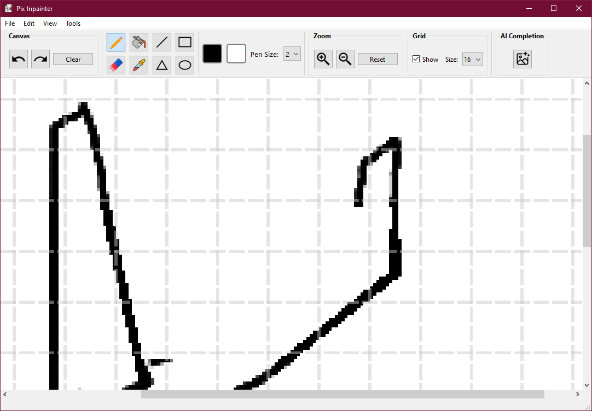

# Pix Inpainter

Pix Inpainter is an interactive digital drawing application built in **C++** using the **Qt framework**.
It enables users to create, edit, save, and share digital artwork through an intuitive interface, while also integrating **AI-based inpainting** to automatically fill missing strokes of a simple sketch.

## Overview

The application is organized around a **main window** that serves as the orchestrator of the entire graphical interface. It integrates the menu bar, toolbar, and global state management, providing seamless access to all available features.

Pix Inpainter’s functionality is divided into two main modules, each designed according to the **MVC (Model–View–Controller)** architecture:

* **Drawing Module** – handles direct interaction with the canvas, allowing the user to draw using a wide variety of tools. The main window manages the currently selected tool and dispatches commands from the interface to this widget.
* **AI Completion Module** – enables users to send the current image to an external AI server that generates sketch completions. The main window manages the initialization of this widget and prepares the required input data.

## Features

* **Drawing tools**: brush, eraser, line, rectangle, ellipse, triangle, fill bucket, and color picker.
* **Color and brush control**: selection of primary and secondary colors via dedicated buttons and color dialogs, with brush size adjustment.
* **Undo/Redo support**: up to 10 undo/redo steps.
* **Zoom and grid**: fine-grained zoom controls and optional grid overlay.
* **Image import/export**: open existing images from the filesystem, save work as PNG, copy and paste from clipboard.
* **Canvas reset**: quickly clear the drawing canvas.
* **AI-assisted completion**:

  * Send the current image to an external AI server.
  * Choose between available models.
  * Adjust post-processing levels.
  * Compare multiple generated results.
  * Apply the completed image directly onto the canvas.

## AI Models

The AI models integrated into Pix Inpainter are not trained inside this repository.  
Instead, they are the result of a separate project where custom **GAN-based models** were trained for sketch completion.  

The training process and model implementations can be found in the dedicated repository: [Sketch Completion With GANs](https://github.com/MarianFrincu/Sketch-Completion-With-GANs)

**Note:** All AI-generated outputs are **binary (black and white)**, reflecting the sketch-style nature of the dataset and models.

## Installation & Build

Pix Inpainter includes **Visual Studio solution files** for easy setup and comes with a separate Python AI server.

### Desktop Application (C++ / Qt)

1. Clone this repository.
2. Navigate to Pix Inpainter folder.
3. Open the `.sln` file in **Visual Studio 2022** (or later).
4. Make sure **Qt 6.x** is installed and integrated with Visual Studio.
5. Build and run the project from Visual Studio.

**Note:** Tested on **Windows only**.

### AI Server (Python)

The AI server provides inpainting via **REST API**. To run it:

1. Navigate to the Python server folder.
2. Install dependencies:

```bash
pip install flask numpy opencv-python
```

For PyTorch, follow the official guide: [PyTorch Installation](https://pytorch.org/get-started/locally/)

3. Run the server:

```bash
python run.py
```

**Note:** The AI server runs locally on your machine.

## Screenshots

### Main Window & Drawing Tools

Shows the main interface with menu bar, toolbar, and canvas, along with selected drawing tools.



### AI-assisted Completion

Example of AI inpainting on a user sketch. Left: original sketch, Right: completed sketch.


### Multiple Model Comparison

Comparison of different AI-generated results using available models.


